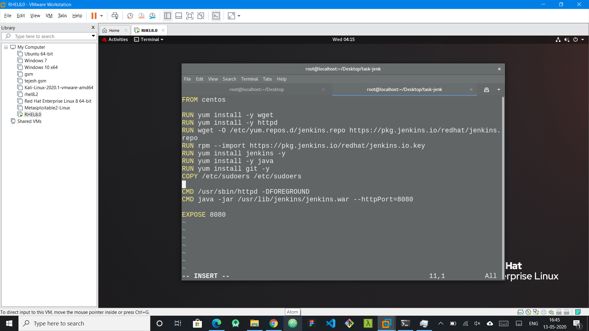
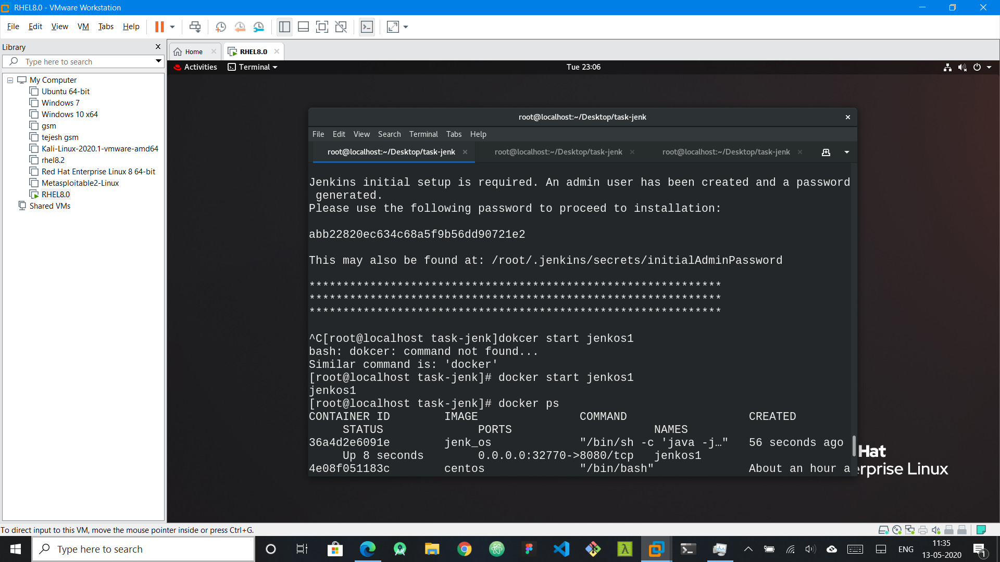
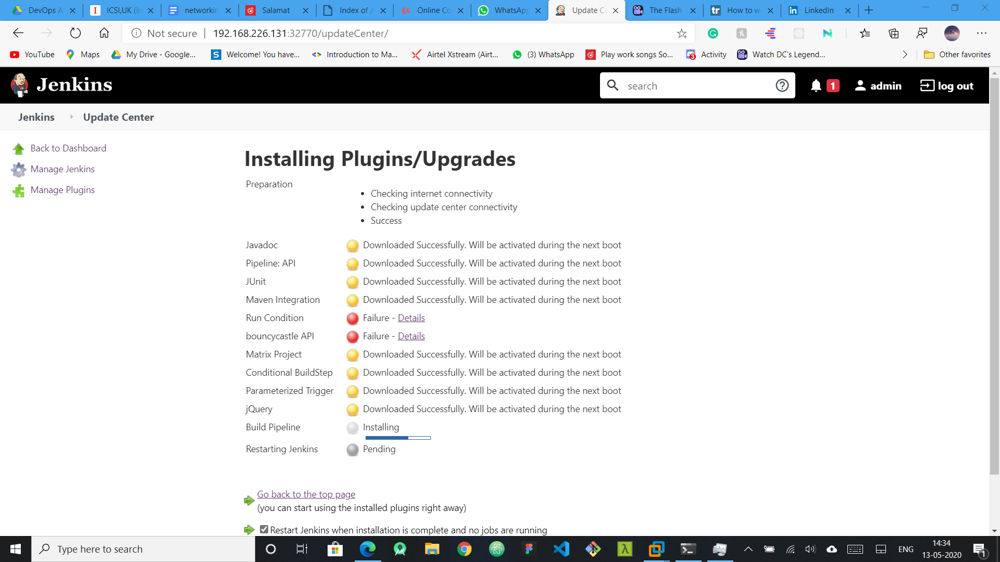
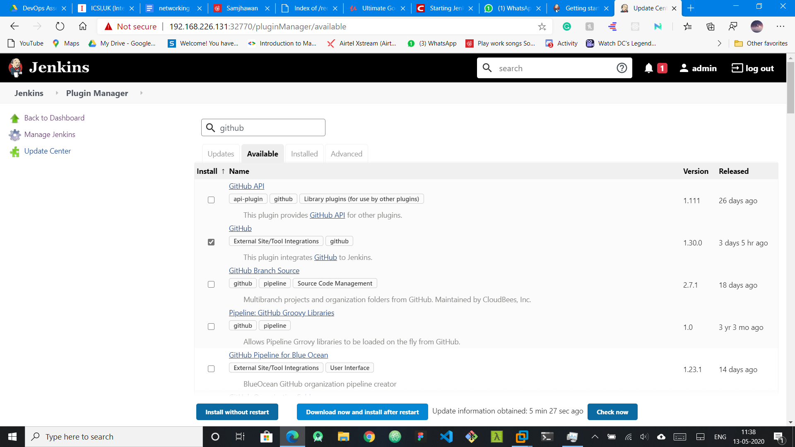

# My project
- I was not able to complete the task because I was getting an error in applying git plugin and downloading plugins has taken a lot of time for installing git

- But I was able to write the `dockerfile` to install the jenkins into a customized docker image.

- after that container is launched with PAT as the port 8080 is exposed.
- The password can be seen if we use docker logs _container_name_ or if we didnot choose the -d option we can directly see it.

- Then we can enter the password as we did in the base os for jenkins.

- Then I installed the plugins like build pipline and github.

- then create a job to start the chain. Here is where i faced an issue to pull the code from the github repository.