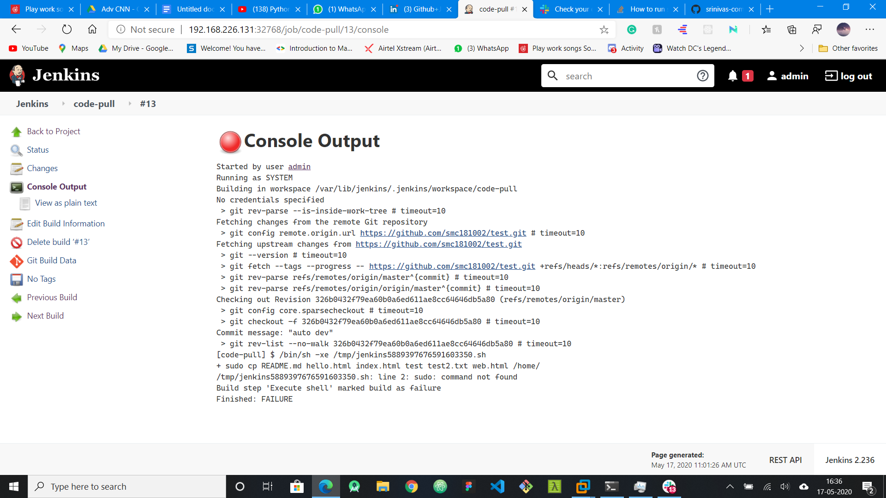
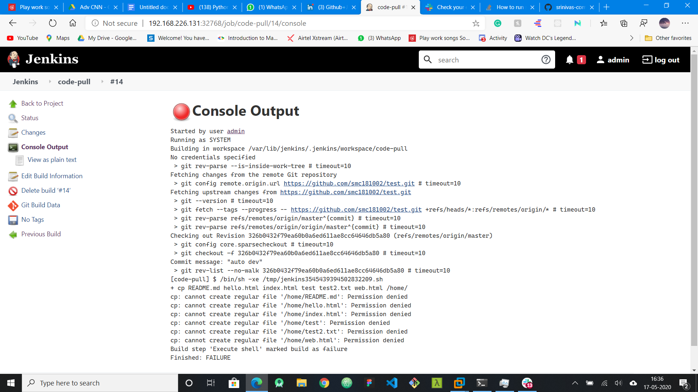

# My project
- I was not able to complete the task because I was getting an error in applying git plugin and downloading plugins has taken a lot of time for installing git

- But I was able to write the `dockerfile` to install the jenkins into a customized docker image.


- after that container is launched with PAT as the port 8080 is exposed.
- The password can be seen if we use docker logs _container_name_ or if we didnot choose the -d option we can directly see it.

- Then we can enter the password as we did in the base os for jenkins.

- Then I installed the plugins like build pipline and github.


- I was able to solve the github access problem by installing git in the container using the dockerfile.

- But there is another error. when I want to copy the code from the workspace of jenkins to by home workspace there is another error. Even though I gave the permissions to jenkins, I am not use sudo command as it is throwing an error that there is no sudo command



- so i am not able to complete the task but i have idea that may work

## My Idea

- ##### Job1
  -first create a job.
  - add gitSCM polling and create a webhook.
  - enter the command `cp * /home/`
  - and also I will create a volume and mount it to a local host directory called 'gitcode'.
- ###### Job2
  - as we need to use jenkins container to launch docker from host os, I am thinking of using ssh
  - Instead of giving password what we can do is use the ssh keygen and contact the host os to execute the code to download interpreter
  ```sh
  if [[ ls ./gitcode | grep *.* | grep php && ls ./gitcode | grep *.* | grep html ]]
    then
    docker run -dit -v ./gitcode:/var/www/html custom-php:1
  else if [[ ls ./gitcode | grep *.* | grep html  ]]
    then
    docker run -dit -v ./gitcode:/var/www/html custom-html:1
  else
    docker run -dit -v ./gitcode:/root custom-python:1
  fi
  ```
  - ofcourse the code need to be preceeded by ssh as this code is to be executed from jenkins in hostOS.
- ###### job3
  ```sh
  export status=$(curl -o /dev/null -s -w "$(http_code)" http://{IPAddress}:port/index.html
    if [ status==200 ]
      then
      exit 0
    else 
      exit 1
    fi
  ```
  - a for loop can be executed for all the urls possible in workspace
- ###### job4
  - this can be done with some plugins in jenkins to send a mail. we can make this job run in there is any error in testing
- ###### job5
  - we need to monitor the docker environment
  ```sh
  if [[ docker ps | grep 'custom' ]]
    then
    echo 'container running perfectly'
  else if [[ ls ./gitcode | grep *.* | grep php && ls ./gitcode | grep *.* | grep html ]]
    then
    docker run -dit -v ./gitcode:/var/www/html custom-php:1
  else if [[ ls ./gitcode | grep *.* | grep html  ]]
    then
    docker run -dit -v ./gitcode:/var/www/html custom-html:1
  else
    docker run -dit -v ./gitcode:/root custom-python:1
  fi
  ```

- I am assuming this works. I will update the code and this information as soon as I solve the problem and hope that there are no other problems.